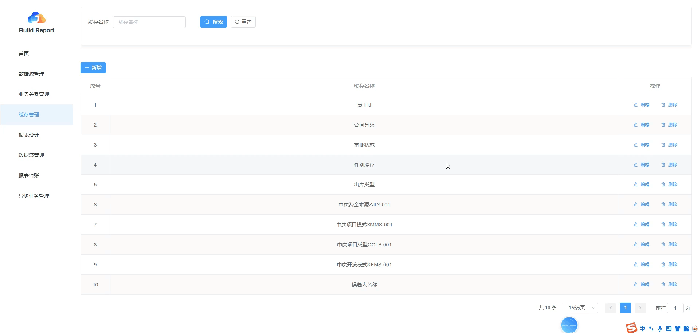
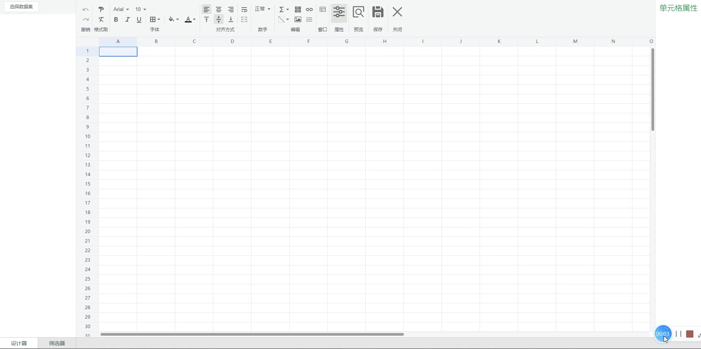

<!-- <picture>
    <source media="(prefers-color-scheme: dark)" srcset="./docs/img/banner-light.png">
    
</picture> -->

## BuildReport 是一个开源的报表引擎，旨在为开发者和业务人员提供强大、灵活且易用的报表解决方案。它支持多数据源集成、可视化报表设计、数据处理与缓存管理，帮助用户快速构建专业的业务报表。 

**多源集成 · 可视化设计 · 高效处理**

[在线体验][playground-link]

<!-- [![][github-license-shield]][github-license-link]
[![][github-actions-shield]][github-actions-link]
[![][github-stars-shield]][github-stars-link]
[![][github-contributors-shield]][github-contributors-link]  
[![][github-forks-shield]][github-forks-link]
[![][github-issues-shield]][github-issues-link] -->

<strong>目录</strong>

- [🎉 背景](#buildreport-开发背景让报表开发从痛点缠身到高效流畅)
- [🌈 亮点](#亮点)
- [📊 对比](#对比)
- [✨ 特性](#特性)
  - [🔗 业务关系管理](#业务关系管理)
  - [💾 缓存管理](#缓存管理)
  - [🎨 报表设计](#报表设计)
  - [🔄 数据流管理（etl）](#数据流管理etl)
  - [⏳ 异步任务](#异步任务)
    <!-- - [👾 在线示例](#在线示例) -->
    <!-- - [💬 社区](#社区) -->
    <!-- - [🤝 贡献](#贡献) -->
    <!-- - [❤️ 赞助](#赞助) -->
- [🎯 技术栈](#技术栈)
- [📄 许可](#许可)
- [📒 使用手册][documentation-link]

## BuildReport 开发背景：让报表开发从“痛点缠身”到“高效流畅”

在企业数字化转型加速的背景下，数据已成为核心生产要素，而报表作为数据价值输出的核心载体，其开发效率与质量直接影响业务决策速度。但在实际业务中，报表开发却长期面临一系列“卡脖子”的痛点，BuildReport 正是在这样的现实需求中应运而生。

## 一、企业报表开发的核心痛点：从数据到决策的“层层阻碍”

### 1. 多源数据整合难，“数据孤岛”成常态

随着企业业务扩张，数据往往分散在 MySQL、Oracle、PostgreSQL 等不同数据库中，甚至存在跨部门、跨系统的数据隔离。传统方式下，技术人员需编写大量自定义脚本实现数据连接，不仅开发周期长，还容易因数据源变更导致报表失效。业务人员想获取“一站式数据视图”需反复依赖 IT 部门，数据获取效率极低。

### 2. 跨库表关联复杂，业务逻辑落地难

企业数据多存在复杂的业务关联（如“订单表-用户表-商品表”的跨库关联），但传统工具缺乏可视化的关联配置能力。技术人员需手动编写 JOIN 语句，不仅容易因字段匹配错误导致数据偏差，更难以让业务人员参与关联规则的确认。最终往往出现“报表数据与业务认知不符”的问题，影响决策可信度。

### 3. 数据处理缺工具，“脏数据”拖慢报表价值

原始业务数据常存在重复、空值、格式混乱等问题，而多数报表工具缺乏轻量化的 ETL 能力。业务人员拿到数据后需手动在 Excel 中清洗、转换，面对十万级以上数据时极易卡顿；技术人员开发专用数据处理脚本又耗时耗力，导致“数据准备阶段占报表开发 60% 以上时间”成为常态。

### 4. 报表设计门槛高，“技术依赖”拖慢响应速度

传统报表工具要么需要编写 SQL 或代码，要么界面复杂难用，业务人员难以自主设计报表。当业务需求变更（如新增字段、调整格式）时，需反复通过“业务提需求 →IT 排期开发 → 测试验证”的流程，一个简单的报表调整可能耗时数天，严重滞后于业务决策节奏。

### 5. 报表复用性低，“重复开发”浪费资源

企业中大量报表存在相似的数据源、计算逻辑或格式规范，但传统方式下缺乏统一的数据集管理与模板机制。不同业务线、不同场景的报表往往“从零开发”，不仅重复消耗人力，还容易因开发标准不统一导致报表格式混乱、数据口径不一致，增加跨部门协作成本。

### 6. 性能与管理双缺失，“用起来卡、找起来难”

当报表涉及千万级数据或高频访问时，缺乏缓存机制的传统报表常出现加载缓慢、系统卡顿问题；同时，大量报表分散存储在个人电脑或文件夹中，缺乏统一的台账管理，导致“报表版本混乱”“历史报表找不到”“权限管控缺失”等问题，数据安全与可追溯性难以保障。

## 二、BuildReport 的诞生：针对性解决报表全流程痛点

正是看到企业在报表开发中面临的“数据难整合、关联难配置、处理难高效、设计难自主、复用难落地、管理难规范”等核心问题，我们团队决定开发一款“以业务为中心、以效率为目标”的报表引擎。

BuildReport 从设计之初就聚焦“**降低技术门槛、提升开发效率、保障数据质量**”三大核心目标：

- 通过**可视化数据源管理**打破数据孤岛，让多库数据“一键连接”；
- 以**拖拽式业务关系配置**简化跨表关联，让业务人员参与规则确认；
- 内置**轻量化 ETL 工具**，实现数据清洗、转换“零代码化”；
- 采用**Excel 风格的可视化设计器**，让业务人员“拖拖拽拽做报表”；
- 以**数据集复用、缓存管理、报表台账**三大机制，解决报表性能与管理问题。

从诞生至今，BuildReport 始终围绕“让报表开发从‘技术驱动’转向‘业务驱动’”的愿景，帮助企业将报表开发周期从“周级”压缩至“小时级”，让数据价值更快触达业务决策，真正实现“数据 → 报表 → 决策”的高效闭环。

## 亮点

- 📊 **多数据源兼容** 支持 MySQL、Oracle、PostgreSQL 等主流数据库，轻松连接企业各类业务数据。
- 🔗 **灵活关系配置** 通过可视化方式建立跨库表关联，支持多维度数据集定义，满足复杂业务报表需求。
- 🚀 **高效数据缓存** 针对常用字典数据提供缓存机制，提升报表加载速度与系统性能。
- 🎨 **直观报表设计** 拖拽式字段配置与 Excel 风格编辑界面，零代码也能快速制作专业报表。
- 🔄 **强大数据处理** 内置完整 ETL 能力，支持数据清理、过滤、转换等操作，确保报表数据质量。
- 📋 **全生命周期管理** 从数据接入到报表发布、查看的全流程管理，支持报表台账与版本追踪。
- 🧩 **易于集成扩展** 轻量化架构设计，可无缝集成到各类业务系统，支持自定义功能扩展。
- 📤 **丰富输出能力** 支持报表预览、导出、打印等多种输出方式，满足不同场景需求。
- ⏰ **异步执行任务** 支持执行操作的时候采取异步方式执行任务，数据量大也不怕等待。

## 对比

| 功能点                          | BuildReport | AJ-report | 积木报表（JimuReport） | 葡萄城报表（GrapeCity） | 帆软报表（FineReport） |
| ------------------------------- | ----------- | --------- | ---------------------- | ----------------------- | ---------------------- |
| 类 Excel 可视化拖拽设计         | ✅          | ❌        | ✅                     | ❌                      | ✅                     |
| 字段拖放至表格一键生成列表框架  | ✅          | ❌        | ❌                     | ❌                      | ❌                     |
| 支持行列插入/删除               | ✅          | ✅        | ✅                     | ✅                      | ✅                     |
| 支持合并单元格                  | ✅          | ✅        | ✅                     | ✅                      | ✅                     |
| 支持冻结表头/列                 | ✅          | ✅        | ✅                     | ✅                      | ✅                     |
| 支持 MySQL/Oracle/PostgreSQL    | ✅          | ✅        | ✅                     | ✅                      | ✅                     |
| 原生跨库表关联生成数据集        | ✅          | ❌        | ❌                     | ❌                      | ❌                     |
| 基础单元格公式（求和/平均值等） | ✅          | ✅        | ✅                     | ✅                      | ✅                     |
| 支持字段级计算                  | ✅          | ❌        | ✅                     | ✅                      | ✅                     |
| 基础样式（字体/颜色/对齐）      | ✅          | ✅        | ✅                     | ✅                      | ✅                     |
| 支持条件格式                    | ✅          | ❌        | ✅                     | ✅                      | ✅                     |
| 支持 PDF 导出                   | ✅          | ❌        | ✅                     | ✅                      | ✅                     |
| 支持 Excel 导出                 | ✅          | ✅        | ✅                     | ✅                      | ✅                     |
| 支持打印预览/分页设置           | ✅          | ❌        | ✅                     | ✅                      | ✅                     |
| 支持分组小计                    | ✅          | ❌        | ✅                     | ✅                      | ✅                     |
| 支持表头合并                    | ✅          | ✅        | ✅                     | ✅                      | ✅                     |
| 支持简单主子表                  | ✅          | ❌        | ✅                     | ✅                      | ✅                     |
| 非技术人员快速上手（无需培训）  | ✅          | ❌        | ❌                     | ❌                      | ❌                     |
| 开源免费（社区版功能完整）      | ✅          | ❌        | ❌                     | ❌                      | ❌                     |
| 支持二次开发                    | ✅          | ❌        | ❌                     | ❌                      | ❌                     |
| 轻量化架构嵌入第三方系统        | ✅          | ❌        | ❌                     | ❌                      | ❌                     |
| 提供简洁 API 接口               | ✅          | ❌        | ❌                     | ❌                      | ❌                     |

<!-- ## 👾 在线示例

查看 BuildReport 在实际场景中的应用效果：

[![][examples-preview-dashboard]][examples-link-dashboard]

你可以在 [BuildReport Examples](https://buildreport.ai/examples) 中找到所有示例：

|             **🔌 数据源配置**              |            **🔗 业务关系设计**             |            **🎨 报表设计演示**             |
| :----------------------------------------: | :----------------------------------------: | :----------------------------------------: |
| [![][examples-preview-0]][examples-link-0] | [![][examples-preview-1]][examples-link-1] | [![][examples-preview-2]][examples-link-2] |
|            **🔄 ETL 数据处理**             |            **📋 报表台账展示**             |           **📤 报表导出与打印**            |
| [![][examples-preview-3]][examples-link-3] | [![][examples-preview-4]][examples-link-4] | [![][examples-preview-5]][examples-link-5] | -->
<!--
## 🔒 安全

BuildReport 重视数据安全与隐私保护，采用多种安全措施：

- 数据源密码加密存储，避免明文泄露
- 细粒度权限控制，限制报表与数据源的访问范围
- 定期安全审计与依赖更新，修复潜在安全漏洞

详细安全策略请参阅 [安全政策](./SECURITY.md)。 -->

<!-- ## 🤝 贡献

我们欢迎各种形式的贡献，包括但不限于：

- 提交 Bug 报告或功能建议（[Issues](https://github.com/buildreport-project/buildreport/issues)）
- 完善文档或翻译内容
- 提交代码 PR 修复 Bug 或实现新功能

贡献前请阅读 [贡献指南](./CONTRIBUTING.md)，了解开发环境搭建与 PR 流程。

## ❤️ 赞助

BuildReport 的持续发展离不开社区的支持。如果你觉得项目有价值，欢迎通过 [Open Collective](https://opencollective.com/buildreport) 赞助我们。

感谢以下赞助者的支持（排名不分先后）：

[![][sponsor-badge-0]][sponsor-link-0]
[![][sponsor-badge-1]][sponsor-link-1]
[![][sponsor-badge-2]][sponsor-link-2] -->

## 特性

BuildReport 提供全面的报表构建与管理功能，覆盖数据接入、处理、设计到展示的全流程：

### 业务关系管理

- **跨库表关联** 支持选择不同数据源中的表，通过设置关联字段（如主键-外键）建立业务关系。
- **关联预览** 实时预览表关联效果，直观展示数据关联关系与样本数据。
- **数据集定义** 为每个业务关系配置多个设计器数据集和筛选器数据集：
  - 设计器数据集：用于报表设计阶段的数据展示配置
  - 筛选器数据集：用于报表查询时的条件筛选配置
- **字段自定义** 每个数据集默认包含关联表的所有字段，支持手动勾选需展示的字段，简化报表设计。
- **示例**
  <picture>
  <source media="(prefers-color-scheme: dark)" srcset="./docs/2025-08-18T05_54_27.391Z-893875.gif">
  
  </picture>

### 缓存管理

- **字典缓存** 支持缓存常用业务字典数据（如性别、状态、部门等固定枚举值）。
- **缓存配置** 可自定义缓存过期时间、刷新策略，平衡数据实时性与系统性能。
- **缓存监控** 提供缓存命中统计、缓存大小监控等功能，优化缓存策略。
- **手动刷新** 支持手动触发缓存刷新，确保关键数据及时更新。
- **示例**
  <picture>
  <source media="(prefers-color-scheme: dark)" srcset="./docs/2025-08-18T06_40_40.522Z-541524.gif">
  
  </picture>
   
  <picture>
  <source media="(prefers-color-scheme: dark)" srcset="./docs/2025-08-18T06_29_47.004Z-423233.gif">
  
  </picture>

### 报表设计

- **数据集选择** 先选择预设的设计器数据集，自动加载对应字段列表。
- **拖拽设计** 支持通过拖拽方式将字段放入报表表格，快速构建报表结构。
- **一键生成** 提供"一键生成列表"功能，自动根据数据集字段创建标准报表框架。
- **Excel 风格编辑** 编辑区域采用类 Excel 界面，支持单元格合并、行列调整等操作。
- **格式设置** 提供丰富的格式配置功能：
  - 文本格式：字体、大小、颜色、加粗、斜体等
  - 对齐方式：水平对齐、垂直对齐、自动换行等
  - 单元格样式：背景色、边框、条件格式等
- **高级功能** 支持公式计算、超链接插入、图片嵌入、数据钻取等增强功能。
- **输出能力** 内置预览、导出（Excel、PDF）、打印等功能按钮，便捷输出报表成果。
- **示例**
  <picture>
  <source media="(prefers-color-scheme: dark)" srcset="./docs/2025-08-18T05_34_40.919Z-436974.gif">
  
  </picture>

### 数据流管理（ETL）

- **数据选择** 支持从指定数据源的表中选择部分或全部数据进行处理。
- **数据清理** 提供去重、空值处理（填充默认值、删除空行）、格式标准化等清理功能。
- **条件过滤** 支持通过自定义条件筛选数据，保留符合业务规则的记录。
- **数据转换** 提供丰富的数据转换能力：
  - 行转列：将多行数据转换为列展示
  - 列转行：将多列数据转换为行展示
  - 字段计算：新增计算字段（如销售额=单价 × 数量）
  - 数据合并：根据关键字段合并多个表的数据
- **处理预览** 实时预览数据处理效果，支持逐步调试处理流程。
- **处理保存** 可将 ETL 处理流程保存为模板，供后续报表设计复用。
- **示例**
  <picture>
  <source media="(prefers-color-scheme: dark)" srcset="./docs/2025-08-18T07_07_58.258Z-342096.gif">
  
  </picture>

### 异步任务

- **灵活配置** 支持可选是否异步执行操作，例如预览、导出、打印
- **明确提示** 当开启异步的时候，执行操作会额外生成异步任务，如遇卡顿时间长等，可以后续在异步任务继续查看结果
- **示例**
  <picture>
  <source media="(prefers-color-scheme: dark)" srcset="./docs/2025-08-18T08_35_18.071Z-966040.gif">
  
  </picture>
  <picture>
  <source media="(prefers-color-scheme: dark)" srcset="./docs/2025-08-18T08_39_54.736Z-861156.gif">
  
  </picture>

## 技术栈

### 🎨 前端

- **框架** Vue.js 2.x
- **UI 组件库** Element UI
- **网络请求** Axios（封装在 src/http/index.js 中）
- **样式预处理器** SCSS

### 🔐 后端

- **框架** springboot2

## 💬 社区

BuildReport 社区欢迎所有开发者与用户参与交流。

加入社区方式：

- 通过以下方式加入中文交流群

- 微信号 buildreport2025
- QQ 群号 446436457

<!-- 你也可以在以下平台关注我们：

[知乎][zhihu-community-link] | [掘金][juejin-community-link] -->

## 许可

Copyright © 2025 大连云建数科 BuildReport Team. All Rights Reserved.

本项目基于 [Apache License 2.0](LICENSE) 开源协议发布，详情请参见 LICENSE 文件。

<!-- Links -->

[github-license-shield]: https://img.shields.io/github/license/buildreport-project/buildreport?style=flat-square
[github-license-link]: ./LICENSE
[github-actions-shield]: https://img.shields.io/github/actions/workflow/status/buildreport-project/buildreport/build.yml?style=flat-square
[github-actions-link]: https://github.com/buildreport-project/buildreport/actions/workflows/build.yml
[github-stars-link]: https://github.com/buildreport-project/buildreport/stargazers
[github-stars-shield]: https://img.shields.io/github/stars/buildreport-project/buildreport?style=flat-square
[github-trending-shield]: https://trendshift.io/api/badge/repositories/xxxx
[github-trending-url]: https://trendshift.io/repositories/xxxx
[github-contributors-link]: https://github.com/buildreport-project/buildreport/graphs/contributors
[github-contributors-shield]: https://img.shields.io/github/contributors/buildreport-project/buildreport?style=flat-square
[github-forks-link]: https://github.com/buildreport-project/buildreport/network/members
[github-forks-shield]: https://img.shields.io/github/forks/buildreport-project/buildreport?style=flat-square
[github-issues-link]: https://github.com/buildreport-project/buildreport/issues
[github-issues-shield]: https://img.shields.io/github/issues/buildreport-project/buildreport?style=flat-square
[readme-en-link]: ./README.md
[readme-zh-link]: ./README-zh.md
[readme-ja-link]: ./README-ja.md
[readme-es-link]: ./README-es.md
[official-site-link]: https://buildreport.ai/zh-CN
[documentation-link]: https://yun-jian.yuque.com/org-wiki-yun-jian-uitqdm/ggunp4/fzav6uk52knvdoet
[playground-link]: http://60.205.201.14:8082/buildreport
[github-community-link]: https://github.com/buildreport-project/buildreport/discussions
[github-community-badge]: https://img.shields.io/badge/github-buildreport-24292e?labelColor=black&logo=github&logoColor=white&style=for-the-badge
[twitter-community-link]: https://twitter.com/buildreporthq
[zhihu-community-link]: https://www.zhihu.com/org/buildreport
[juejin-community-link]: https://juejin.cn/user/xxxx
[sponsor-link-0]: https://opencollective.com/buildreport/sponsor/0/website
[sponsor-link-1]: https://opencollective.com/buildreport/sponsor/1/website
[sponsor-link-2]: https://opencollective.com/buildreport/sponsor/2/website
[sponsor-badge-0]: https://opencollective.com/buildreport/sponsor/0/avatar.svg
[sponsor-badge-1]: https://opencollective.com/buildreport/sponsor/1/avatar.svg
[sponsor-badge-2]: https://opencollective.com/buildreport/sponsor/2/avatar.svg
[examples-preview-dashboard]: ./docs/img/examples-dashboard.gif
[examples-preview-0]: ./docs/img/examples-datasource.gif
[examples-preview-1]: ./docs/examples-relation.gif
[examples-preview-2]: ./docs/img/examples-design.gif
[examples-preview-3]: ./docs/img/examples-etl.gif
[examples-preview-4]: ./docs/img/examples-reports.gif
[examples-preview-5]: ./docs/img/examples-export.gif
[examples-link-dashboard]: https://buildreport.ai/examples/dashboard
[examples-link-0]: https://buildreport.ai/examples/datasource
[examples-link-1]: https://buildreport.ai/examples/relation
[examples-link-2]: https://buildreport.ai/examples/design
[examples-link-3]: https://buildreport.ai/examples/etl
[examples-link-4]: https://buildreport.ai/examples/reports
[examples-link-5]: https://buildreport.ai/examples/export
